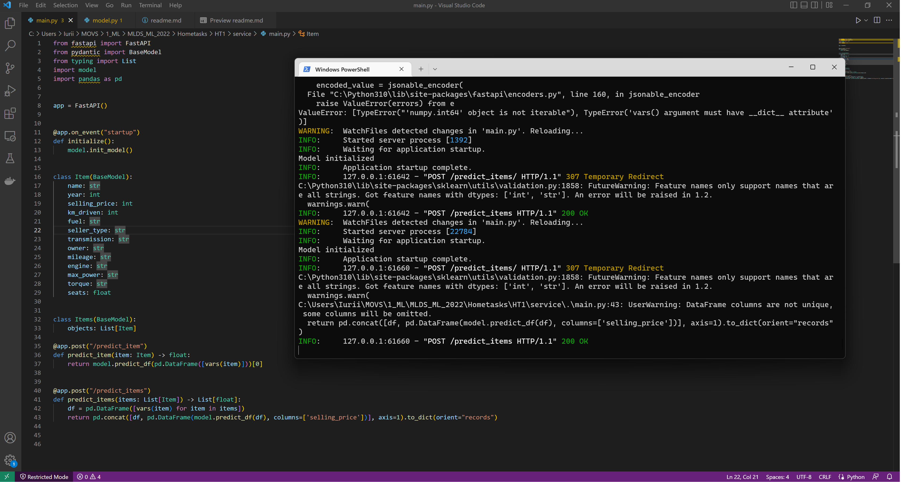
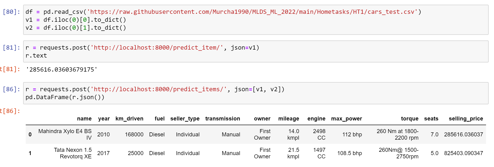

# Модель регрессии для предсказания стоимости автомобилей 

## Обучение модели
Лучший результат R2: 0.948, 45% предсказаний отличаются от дейстительных значений не более чем на 10% на тесте.  
При этом в базовом варианте без категориальных фич (только крутящий момент преобразован в числа) R2 оказывался всего 0.615.  
Добавление категориальных фич увеличило R2 до 0.665.  
Максимальное увеличение предсказательной силы модели дал фич-инжиниринг.
1) Добавлены квадраты года, мощности и объема двигателя  
2) Добавлен столбец мощность / объем двигателя  
3) Добавлен столбец с маркой машины (извлекается из названия автомобиля).  
Небольшой прирост дал перебор альфы с GridSearchCV  

В принципе, получен неплохой результат, поэтому дополнительные фичи не добавлял.  

## Сервис
Сервис запущен локально. Протестирован с помощью requests (см. скриншоты ниже)

